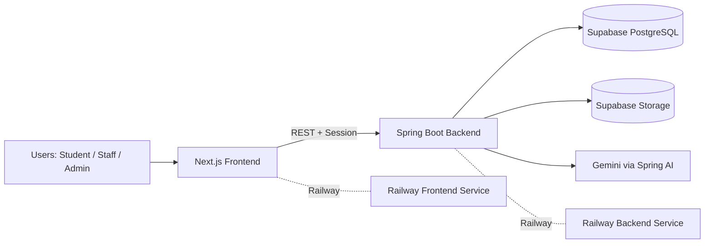
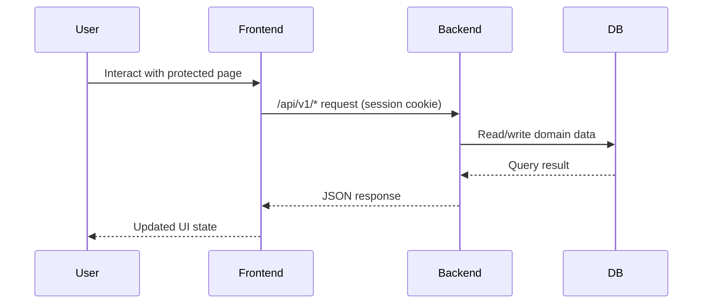

# SmartCampus

SmartCampus is a production-oriented full-stack SaaS platform for campus operations—resource management, bookings, ticketing, notifications, and analytics in one role-aware system.

Live application: **https://triumphant-warmth-production-14f0.up.railway.app/**

---

## 1) Executive Summary

SmartCampus is built as a split architecture:
- **Frontend**: Next.js 16 web app for public/auth flows and role-based workspace UI
- **Backend**: Spring Boot 3.5 API handling authentication, authorization, business logic, and persistence
- **Data & Storage**: Supabase PostgreSQL + Supabase Storage
- **Hosting**: Railway for frontend and backend services

Target users:
- **Students** for requesting resources and reporting issues
- **Staff** for operational ticket resolution
- **Admins** for platform governance, approvals, and analytics

---

## 2) Key Features by Role

### Student
- Google OAuth sign-in
- Browse resources and availability
- Create and track bookings
- Raise support/incident tickets with attachments
- View notifications and profile updates

### Staff
- Local credential sign-in
- Access assigned tickets
- Update ticket status and collaborate with comments
- View notifications and manage profile

### Admin
- Full user management (role/status/local credentials)
- Resource catalog CRUD (categories, locations, resources)
- Booking review (approve/reject/cancel)
- Ticket assignment and lifecycle control
- Notification oversight and admin analytics
- AI-enabled analytics assistance (environment-driven)

---

## 3) Tech Stack (with Versions & Rationale)

| Layer | Technology | Version | Why it is used |
|---|---|---:|---|
| Frontend framework | Next.js | 16.2.3 | App Router, server rendering, robust deployment model |
| UI runtime | React | 19.2.4 | Modern component model for scalable UI |
| Frontend language | TypeScript | ^5 | Static typing and maintainability |
| Styling | Tailwind CSS | ^4 | Fast utility-first styling and design consistency |
| UI components | Material-UI | Not pinned in current `frontend/package.json` | Mentioned in stack context; useful for enterprise-ready component patterns |
| Backend framework | Spring Boot | 3.5.13 | Mature production backend with auto-configuration |
| Backend language | Java | 21 | LTS runtime with modern language/runtime features |
| Auth & security | Spring Security + OAuth2 Client | via Spring Boot 3.5.13 | Session auth, RBAC, Google OAuth integration |
| Persistence | Spring Data JPA | via Spring Boot 3.5.13 | Repository abstraction and domain-oriented data access |
| Validation | Spring Validation | via Spring Boot 3.5.13 | Request-level and domain constraint validation |
| DB migrations | Flyway | via Spring Boot 3.5.13 | Versioned, repeatable schema evolution |
| Database | PostgreSQL (Supabase) | Managed | Relational consistency for operational workloads |
| Object/file storage | Supabase Storage | Managed | Ticket/resource media storage integration |
| AI integration | Spring AI + Google Gemini | Spring AI BOM 1.1.4 | AI-enhanced analytics and assistant features |
| Deployment | Railway | Managed PaaS | Simplified service deployment and environment management |

Evidence sources: `frontend/package.json`, `backend/pom.xml`, `docs/tech-stack.md`, `docs/deployment.md`.

---

## 4) Architecture Overview

### High-level component design



### Request flow (authenticated)



---

## 5) Project Structure (High-Level)

```text
SmartCampus/
├── backend/            # Spring Boot API, modules, Flyway migrations
├── frontend/           # Next.js web application (App Router)
├── docs/               # Deployment, workflows, schema, API references
├── images/             # Project screenshots/assets
├── legacy-backend/     # Historical backend reference
├── legacy-frontend/    # Historical frontend reference
└── README.md
```

---

## 6) Core Modules

### Authentication & Authorization
- Google OAuth for students
- Local login for staff/admin
- Session-based authentication
- Role-based access controls in backend security config
- Key paths: `modules/auth/*`, `modules/user/*`, `/api/v1/auth/*`

### Resources
- Categories, locations, resources
- Resource availability windows
- Admin-only mutation with role-aware access
- Key paths: `modules/resource/*`, `/api/v1/resources*`, `/api/v1/locations*`, `/api/v1/resource-categories*`

### Bookings
- Role-aware listing (`STUDENT` own vs `ADMIN` all)
- Request/review/cancel lifecycle
- Overlap and availability validation
- Key paths: `modules/booking/*`, `/api/v1/bookings*`

### Tickets
- Ticket categories, reporting, assignment, status updates
- Comments and attachment metadata flow
- Staff/admin operational workflow with student visibility constraints
- Key paths: `modules/ticket/*`, `/api/v1/tickets*`, `/api/v1/ticket-categories*`

### Notifications
- Event-driven notification records
- Read/unread tracking
- Key paths: `modules/notification/*`, `/api/v1/notifications*`

### Analytics & AI
- Admin analytics endpoints and services
- AI-assisted analysis via Spring AI/Gemini (configurable)
- Key paths: `modules/adminanalytics/*`, `modules/ai/*`, `/analytics`

---

## 7) Database Schema (Key Tables & Relationships)

Primary domains:
- **Identity**: `users`, `roles`, `user_roles`, `local_auth_credentials`
- **Resources**: `resource_categories`, `locations`, `resources`, `resource_availability_windows`
- **Bookings**: `bookings`
- **Tickets**: `ticket_categories`, `tickets`, `ticket_comments`, `ticket_attachments`, `ticket_assignments`
- **Cross-cutting**: `notifications`, `audit_logs`

Core relationships:
- `users` 1:N `bookings`, `tickets`, `notifications`
- `resources` 1:N `bookings`, `tickets`
- `tickets` 1:N `ticket_comments`, `ticket_attachments`, `ticket_assignments`
- `roles` + `user_roles` model active role with role-history support

See:
- `docs/database/schema.md`
- `docs/database/relationships.md`
- `backend/src/main/resources/db/migration/V1__create_baseline_schema.sql`

---

## 8) Setup & Installation (Local Development)

### Prerequisites
- Node.js 20+
- npm
- Java 21
- Supabase project (PostgreSQL + Storage buckets)

### 1) Clone and open repository

```bash
git clone https://github.com/dinukadilshan03/SmartCampus.git
cd SmartCampus
```

### 2) Configure backend environment

```bash
cp backend/.env.example backend/.env
# then edit backend/.env values
```

Minimum required values include DB connection, Supabase keys, Google OAuth credentials, and admin bootstrap credentials.

### 3) Run backend

```bash
cd backend
chmod +x mvnw
./mvnw spring-boot:run
```

Backend default URL: `http://localhost:8080`

### 4) Configure frontend environment

Create `frontend/.env.local`:

```env
NEXT_PUBLIC_API_BASE_URL=http://localhost:8080
```

### 5) Run frontend

```bash
cd frontend
npm install
npm run dev
```

Frontend default URL: `http://localhost:3000`

---

## 9) Deployment Guide (Railway)

### Backend service (`backend/`)
- Build: `./mvnw -DskipTests package`
- Start: `java -jar target/backend-0.0.1-SNAPSHOT.jar`

### Frontend service (`frontend/`)
- Build: `npm install && npm run build`
- Start: `npm run start`

### Required environment variables

**Backend** (major):
- `PORT`, `FRONTEND_URL`
- `DB_CONNECTION_MODE`, `DB_URL_POOLER`, `DB_URL_DIRECT`, `DB_USER_POOLER`, `DB_USER_DIRECT`, `DB_PASSWORD`
- `SUPABASE_URL`, `SUPABASE_SERVICE_ROLE_KEY`
- `SUPABASE_RESOURCE_IMAGES_BUCKET`, `SUPABASE_TICKET_ATTACHMENTS_BUCKET`
- `GOOGLE_CLIENT_ID`, `GOOGLE_CLIENT_SECRET`
- `BOOTSTRAP_ADMIN_EMAIL`, `BOOTSTRAP_ADMIN_TEMP_PASSWORD`
- `GEMINI_API_KEY`, `SPRING_AI_CHAT_MODEL`, `Ticketing_API_KEY`

**Frontend**:
- `PORT`
- `BACKEND_INTERNAL_URL`
- `NEXT_PUBLIC_API_BASE_URL`

Railway wiring rules:
1. `FRONTEND_URL` must equal public frontend origin.
2. `BACKEND_INTERNAL_URL` should use Railway private backend URL.
3. `NEXT_PUBLIC_API_BASE_URL` should use backend public URL.

Full reference: `docs/deployment.md`.

---

## 10) API Documentation (Key Endpoints + Examples)

Base URL (local): `http://localhost:8080`

### Health

```http
GET /api/v1/health
```

### Current user

```http
GET /api/v1/auth/me
```

### Local login (staff/admin)

```http
POST /api/v1/auth/login
Content-Type: application/json

{
  "email": "admin@smartcampus.edu",
  "password": "your-password"
}
```

### Create booking

```http
POST /api/v1/bookings
Content-Type: application/json

{
  "resourceId": 12,
  "bookingDate": "2026-05-05",
  "startTime": "10:00",
  "endTime": "12:00",
  "purpose": "Seminar",
  "expectedAttendees": 40
}
```

### Review booking (admin)

```http
PATCH /api/v1/bookings/{id}/review
Content-Type: application/json

{
  "decision": "APPROVE",
  "reviewNote": "Approved for academic use"
}
```

### Create ticket

```http
POST /api/v1/tickets
Content-Type: application/json

{
  "ticketCategoryId": 3,
  "title": "Projector not working",
  "description": "No display output in room B-201",
  "resourceId": 7,
  "priority": "HIGH"
}
```

More endpoints: `docs/api/endpoints.md`.

---

## 11) Folder Structure (Frontend + Backend)

### Frontend (`frontend/src`)

```text
app/
  (public)/             # login, auth callback, password flows
  (app)/                # protected workspace routes
  api/                  # frontend route handlers/proxies
components/             # UI and feature components
lib/                    # API clients, auth helpers, feature utilities
types/                  # TypeScript contracts
```

### Backend (`backend/src/main/java/com/smartcampus/backend`)

```text
common/                 # shared config, exceptions, utilities
modules/
  auth/
  user/
  resource/
  booking/
  ticket/
  notification/
  profile/
  adminanalytics/
  ai/
```

---

## 12) Feature Workflows

### Booking flow
1. User selects resource and time range.
2. Backend validates availability and overlap.
3. Booking is created (`PENDING`/`APPROVED` depending on policy).
4. Admin can approve/reject; user/admin can cancel according to rules.
5. Notifications are emitted for status changes.

### Ticket flow
1. User creates ticket with context and optional attachment metadata.
2. Admin assigns/reassigns to staff.
3. Staff/admin update ticket status (`OPEN -> IN_PROGRESS -> RESOLVED -> CLOSED`, with admin rejection support from `OPEN`).
4. Comments/notes support collaboration and traceability.

### Authentication flow
1. Student signs in via Google OAuth; staff/admin via local credentials.
2. Frontend bootstraps session from `/api/v1/auth/me`.
3. Backend enforces role and account-status checks.

Detailed flows: `docs/workflows.md`.

---

## 13) Performance Metrics & Optimization Notes

### Current observable metrics (local build sample, 2026-04-21)
- Next.js production build compile: **~3.9s**
- TypeScript phase: **~5.4s**
- Static generation: **20 pages (~325ms generation phase)**

### Lighthouse
- Lighthouse reports are **not yet committed** in this repository.
- Recommended command:

```bash
npx lighthouse https://triumphant-warmth-production-14f0.up.railway.app/ --view
```

### Optimization notes
- Next.js App Router with production build pipeline already in place
- Frontend-to-backend internal rewrites reduce network complexity in Railway
- Backend uses connection-pool settings and Flyway-managed schema for predictable runtime behavior

---

## 14) Testing & Quality

### Existing strategy
- Backend includes unit and slice/controller tests under `backend/src/test/java`
- Frontend currently relies on lint + production build validation (no dedicated test suite committed in `frontend/src`)
- CI pipeline (`.github/workflows/ci.yml`) runs:
  - backend: `./mvnw -B clean package -DskipTests`
  - frontend: `npm ci && npm run build`

### Quality practices
- Type-safe frontend contracts via TypeScript
- Validation and DTO-based APIs in backend
- Schema-change discipline through Flyway migrations

---

## 15) Security Considerations

Implemented safeguards:
- Spring Security RBAC with endpoint-level role constraints
- Session cookie hardening (`httpOnly`, `same-site=lax`)
- CORS restricted to configured frontend origin
- Password hashing with BCrypt
- Request validation via Spring Validation
- Backend-owned Supabase access (frontend does not directly mutate DB/storage)

Operational recommendation:
- Introduce explicit API rate limiting at gateway or app layer if traffic increases.

---

## 16) Troubleshooting

### Backend fails with `release version 21 not supported`
Use Java 21 (`java -version`) before running Maven.

### OAuth redirect issues
Verify:
- `FRONTEND_URL` (backend)
- `BACKEND_INTERNAL_URL` (frontend)
- `NEXT_PUBLIC_API_BASE_URL` (frontend)
- Google OAuth redirect URI: `/login/oauth2/code/google`

### Frontend cannot reach API
- Confirm backend is running on expected URL
- Check `NEXT_PUBLIC_API_BASE_URL`
- Check rewrite settings in `frontend/next.config.ts`

### Database connection errors
- Verify `DB_CONNECTION_MODE` and Supabase credentials
- Switch between pooler/direct if local network blocks one path

---

## 17) Contribution Guidelines

1. Fork and create a feature branch.
2. Keep changes scoped to one concern.
3. For schema changes, add Flyway migrations (do not patch DB manually).
4. Update docs when changing module behavior or APIs.
5. Validate locally:

```bash
# backend
cd backend && ./mvnw -B clean package -DskipTests

# frontend
cd frontend && npm ci && npm run build
```

6. Open PR with clear module-level impact summary.

---

## 18) Learning Outcomes

This project demonstrates:
- End-to-end full-stack system design (Next.js + Spring Boot)
- Role-based authentication/authorization in multi-user SaaS
- Production deployment with managed infrastructure (Railway + Supabase)
- Migration-driven relational schema management with Flyway
- Structured backend module architecture for maintainability
- AI integration patterns using Spring AI and Gemini

---

## 19) Future Enhancements (Roadmap)

- Add frontend automated tests (unit + integration)
- Add formal API specification (OpenAPI/Swagger export)
- Add explicit rate limiting and abuse-prevention middleware
- Add observability dashboards (traces/metrics/log aggregation)
- Publish periodic Lighthouse + load-test benchmark reports
- Expand analytics with deeper forecasting insights

---

## 20) License & Author

- **License**: MIT (`LICENSE`)
- **Repository**: https://github.com/dinukadilshan03/SmartCampus
- **Author/Owner**: [dinukadilshan03](https://github.com/dinukadilshan03)

---

## Additional Documentation

- `docs/deployment.md`
- `docs/tech-stack.md`
- `docs/workflows.md`
- `docs/api/endpoints.md`
- `docs/database/schema.md`
- `docs/database/relationships.md`

